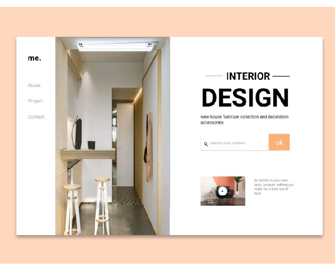

# Home decoration UI design

This project was created using _flexbox_ features.

I translated this UI design to actual codes.

## Design
This design Inspiration was gotten from the screen shot below


## Images
Images used in this project were gotten from Unsplash. I suggest checking out [Unsplash](https://unsplash.com/)
svg icon used, were gotten from [IcoMoon App](https://icomoon.io/app/#/select) from their free libaries.

## Setup Instructions

### Sass need to be installed locally on your computer to get you starting.
Starting the project runs a local server, watches Sass files, builds Sass to CSS and live reloads.
 
 ```
 install node.js
 ```
Helps you to write tools for local development.
 
 ```
 npm install 
 ```
  Manages packages on your local computer, for development.

  ```
  npm run start
  ```
  for development process.

  ```
  npm run build
  ```
  run all task for production.
